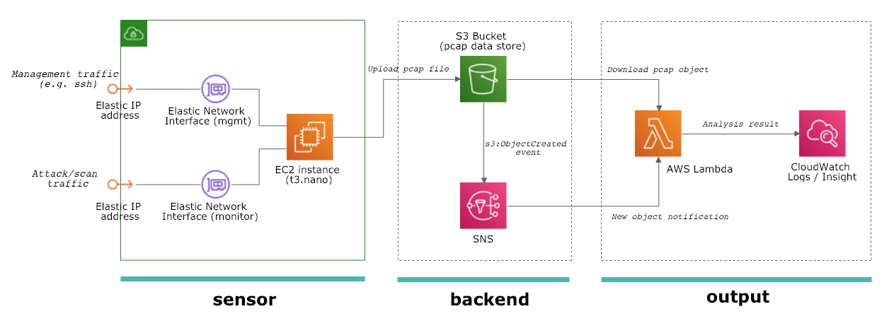

# AWS Honeypot Templates



## Overview

This repository provides CloudFormation templates of low interaction honeypot on AWS.

## How to deploy

### Prerequisite

- python >= 3.7
- awscli >= 1.14.40
  - with credentials. See [AWS document](https://docs.aws.amazon.com/cli/latest/userguide/cli-chap-configure.html) for more detail


### 1) Setup backend

```bash
$ aws cloudformation deploy \
    --template-file backend.yml \
    --stack-name <backend_stack_name> \
    --capabilities CAPABILITY_IAM
```

**Required parameters**

- `backend_stack_name`: CloudFormation stack name (e.g. `my-honeypot-backend`)

```bash
$ aws cloudformation describe-stack-resources --stack-name <backend_stack_name> | jq '.StackResources[] | select(.LogicalResourceId == "DataStore") | .PhysicalResourceId ' -r
```

### 2) Setup sensor

```
$ aws cloudformation deploy \
    --template-file sensor.yml \
    --stack-name <sensor_stack_name> \
    --capabilities CAPABILITY_IAM \
    --parameter-overrides \
    VpcId=<VpcId> \
    SubnetId=<SubnetId> \
    KeyName=<KeyName> \
    S3Bucket=<S3Bucket>
```

**Required parameters**

- `sensor_stack_name`: CloudFormation stack name (e.g. `my-honeypot-sensor`)
- `VpcId`: VPC ID that you want to connect with the new sensor instance (e.g. `vpc-1234xxxx`)
- `SubnetId`: SubnetID that you want to connect with the new sensor instance (e.g. `subnet-1234xxxx`)
- `KeyName`: SSH keyname that you want to put into the new sensor instance (e.g. `default`)
- `S3Bucket`: backend S3 bucket name to store pcap data (e.g. `my-honeypot-backend-honeypot-logs`)

### 3) Setup output module

```
$ cd output/cwlogs/
$ ./deploy.sh <region> <backend_stack_name> <output_stack_name> <code_s3_bucket> <code_s3_prefix>
```

**Required parameters**

- `region`: AWS region that you want to deploy CloudFormation stack. If you didn't specify region, you can see your default region `aws configure get region`. (e.g. `ap-northeast-1`)
- `backend_stack_name`: backend stack name (e.g. `my-honeypot-backend`)
- `output_stack_name`: Name of a new CloudFormation stack
- `code_s3_bucket`: S3 bucket name to store Lambda code (e.g. `some-other-bucket`)
- `code_s3_prefix`: S3 key prefix to store Lambda code. NOTE: backslash `/` will be appended to tail of specified prefix automatically. (e.g. `function`)


